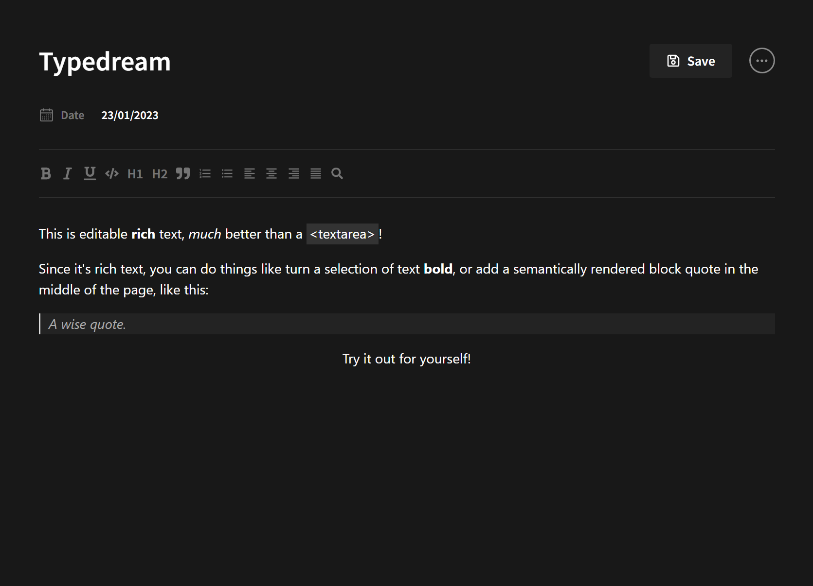

# Front-end Developer Take-Home Project

This project is designed to evaluate the skills and abilities of a front-end developer candidate by requiring them to create a functional rich text editor using the SlateJS library. The project is divided into two parts: the first half requires the candidate to use NextJS to create a functional text editor, and the second half is an optional component for the candidate to create a new custom feature for the editor. The goal of this project is to assess the candidate's proficiency in utilizing new technologies, specifically the SlateJS library, as well as their ability to create functional and customizable text editor.

## Technologies Used

- [Next.Js](https://nextjs.org/docs/)
- [TailwindCSS](https://tailwindcss.com/)
- [SlateJs](https://docs.slatejs.org/)

## Preview

https://typedream.vercel.app/
